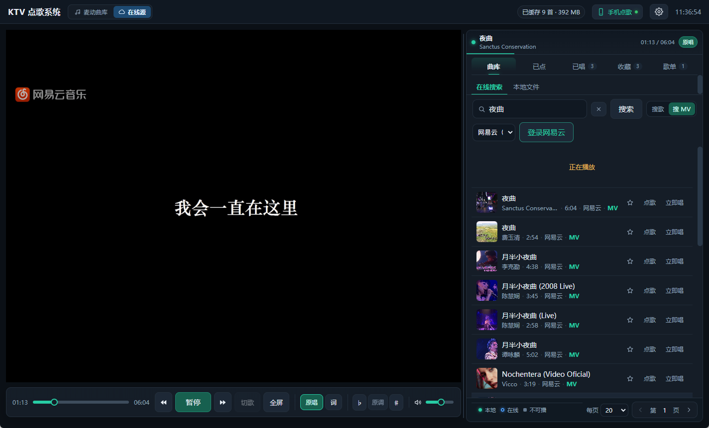
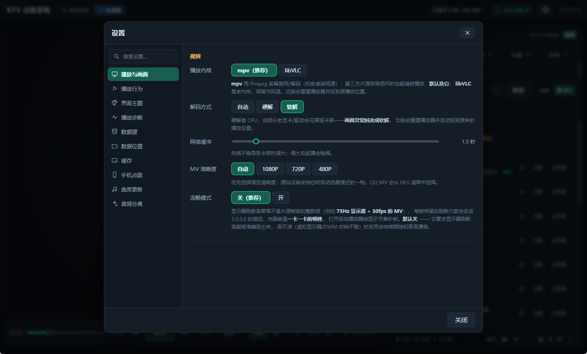

# KTV Desktop

Windows 桌面版 KTV 点歌系统，面向客厅、KTV 包间、触屏点歌机和 Windows 迷你主机。项目复用同作者的 `karaoke-companion`，并参考非商业项目 `maidong-ktv` 的实现方案。

> **非商业项目**：本项目仅供个人学习、研究、测试和非商业使用。禁止商业运营、收费使用、售卖、租赁、硬件预装、捆绑分发或提供收费技术支持。详见 [LICENSE](LICENSE)。





## 主要功能

- 麦动曲库与在线源两套模式，可独立搜索、浏览和播放。
- 在线源支持网易云、QQ音乐、酷狗、咪咕，支持扫码登录和 Cookie 导入。
- 支持在线 MV、音频播放、原唱/伴唱切换、变调、全屏和鼠标/键盘控制。
- 支持歌词搜索、逐字歌词、画面内歌词开关和滚动效果。
- 支持已点、已唱、收藏、歌单、历史去重和本地缓存。
- 支持手机扫码点歌、局域网控制和二维码入口。
- 支持曲库迁移、缓存目录设置、播放内核选择、软解/硬解和在线清晰度设置。
- 支持可选的 AI 音频分离插件（Demucs）。

## 下载

- [GitHub Releases](https://github.com/weisun23/ktv-desktop/releases)
- 安装版：`KTV.Setup.*.exe`
- 免安装版：`KTV.*.exe`

## 数据与隐私

- 平台账号 Cookie 使用 Electron safeStorage 加密保存在本机，不上传到项目服务器。
- 曲库、用户状态、缓存和歌词默认保存在本机数据目录。
- 第三方平台凭证、曲库数据和播放源需要使用者自行确认授权。
- 本项目不内置商业 KTV 服务的第三方取流凭证。

## 来源与许可

| 来源 | 使用范围 |
|---|---|
| `karaoke-companion`（同作者项目，MIT） | Vue 3 前端 UI、歌词组件、在线音乐聚合后端、播放队列业务 |
| `maidong-ktv` (非商业许可) | **仅参考实现方案**：原伴唱切换策略、曲库分发格式、取流协议流程 |

> ⚠️ **与 maidong-ktv 的关系**：只参考其架构思路与功能行为，不复制源码、界面素材或品牌，也不内置其第三方取流凭证。详见 [docs/00-architecture.md](docs/00-architecture.md) §4。

- 麦动原作者：杨家三郎（原许可证中写作 `YnagJiaSanLang`）
- 麦动原项目：https://gitee.com/yangyachao-X/maidong-ktv
- 完整署名：[CREDITS.md](CREDITS.md)
- 第三方许可证：[THIRD_PARTY_NOTICES.md](THIRD_PARTY_NOTICES.md)
- 项目许可证：[LICENSE](LICENSE)

## 技术栈

**Electron（Node）+ Vue 3 + mpv（默认）/ libVLC（回退）+ muse.db 曲库 + 在线取流**

壳为什么不是 Tauri：本机与多数 KTV 装机环境没有 C++ 工具链，Tauri 必须编译 Rust；
Electron 零编译依赖，且无论如何都要随包分发播放内核（libVLC ~180MB / mpv ~120MB）与曲库数据
（988MB），壳的体积差异被抵消。详见 [docs/00-architecture.md](docs/00-architecture.md) §2。

```
┌──────────────────────────────────────────────────────────┐
│  Electron 主进程                                          │
│   ├── 窗口 / IPC / 状态推送                                │
│   ├── WS_CHILD 原生视频区 ──> mpv / libVLC                 │
│   ├── 曲库服务子进程（Node + node:sqlite，988MB muse.db）   │
│   ├── 取流 provider（实时取地址，约 1 小时有效）             │
│   ├── 播放监管器（断流自动重取 + 断点续播）                  │
│   ├── 用户状态（已点队列 / 已唱 / 收藏 / 歌单 / 设置）        │
│   └── 局域网 HTTP 服务（手机点歌，阶段 5）                  │
├──────────────────────────────────────────────────────────┤
│  Vue 3 渲染进程                                           │
│   ├── 曲库浏览：热歌榜 / 搜索 / 歌手 / 本地文件              │
│   ├── 右栏面板：曲库 / 已点 / 已唱 / 收藏 / 歌单             │
│   ├── 播放控制（播放、seek、音量）                          │
│   └── 原伴唱切换（原唱 / 伴唱 / 立体声）                     │
└──────────────────────────────────────────────────────────┘
```

**为什么不是纯 Web**：原伴唱切换依赖"单文件内切音轨 / 切左右声道"，
WebView 的 `<video>` 做不到，必须落到原生播放器。

**播放内核默认用 mpv 而不是 libVLC**：第三方片源自带周期性损坏段（87 处，见
[docs/16](docs/16-mv-stutter-root-cause.md)），libVLC 遇到这种片源要么把视频丢到
15fps，要么让音频在 ~100 秒后彻底停摆；mpv 用 ffmpeg 系解复用/解码（和 Android 端
IJK 同源），同一份片源实测 **29.5fps、丢帧 0、音频全程正常**。
两个内核接口完全一致，设置页「视频 → 播放内核」可随时切回 libVLC。

## 快速开始

```powershell
npm run setup            # 一次性：下载 libVLC、mpv、Node.js 运行时并生成测试片

# 安装曲库（988MB）
npm run install:catalog -- `
  --manifest <maidong-ktv-dir>\database_publish\database\manifest.json `
  --target resources\catalog

# 配置取流凭证（首次启动会自动生成空模板）
notepad resources\config\providers.json

npm run build:web        # 构建前端
npm start                # 启动应用
```

界面快捷键：`空格` 播放/暂停 · `←/→` 快退/快进 5s · `O` 原唱 · `A` 伴唱 · **`[`/`]` 降/升半音 · `\` 还原原调** · `N` 切歌 · `F` 全屏（`Esc` 退出）。

## 歌词

优先取网易云公开接口（与 karaoke-companion 同源，MIT），逐字/逐行都取不到时用 QQ 音乐逐行歌词兜底，按曲目 id 缓存到数据目录。

显示位置有两个**独立开关**（设置页「歌词显示」），**默认只开「画面内」**——
两个都开会在画面里和画面下方各显示一遍。

- **画在视频里**（默认）：用 **ASS 字幕**渲染进画面，**画面底部居中 + 滚动**。
  视频是原生子窗口、永远盖在 HTML 之上，只有播放器自己画才叠得上去。
  控制条上的「词」按钮切的就是**这个**。
- **底部条**：画面下方显示当前行 + 下一行（HTML 元素，默认关）。

画面歌词的观感：当前行从下方**滑入**、停到画面正中，唱到的字跟着变绿；
下一行以暗色**预览**停在下方，轮到它时无缝滑上来接替，换行时上一行淡出。
位置可以在设置里切「画面底部 / 屏幕正中」，滚动特效可以关。

> 开关语义以前是错的：控制条的「词」切的是底部条，用户按半天画面上的字还在。
> 详见 [docs/28](docs/28-mouse-lyrics-source-modes.md)。

歌词本身也做了**候选优选**：同一首歌在网易云常有多个版本，个别版本歌词被替换成
`精神**` 这种屏蔽版，取词时会挑未被屏蔽的那份，启动时还会清理已经写坏的缓存。

## 逐字歌词（卡拉OK）

歌词从"整行高亮"升级成**逐字扫色**：已唱的字变绿，正在唱的字亮白，没唱的是灰色。

- 数据来自网易云 **v1 接口的 `yrc`**（老接口只有逐行），格式是 NDJSON + YRC：
  `[行起始,行时长](字起始,字时长,0)字...`
- 画面里用 **ASS 字幕的 `\k` 卡拉OK标签**渲染（mpv 的 OSD **不解析** ASS 覆盖码，
  实测 `{\b1}` 会原样显示、`{\c&H...&}` 报 "broken escape sequences"）
- 底部歌词条也支持逐字高亮（"只显示底部条"模式）
- **没有逐字数据的歌也走 ASS**（逐行 LRC 编译成同一套滚动字幕），
  所以「居中 + 滚动」对两种歌词都生效；老缓存会在后台自动补一次逐字

详见 [docs/19-word-lyrics.md](docs/19-word-lyrics.md)。

## 数据源：麦动曲库 / 在线源（二选一）

**顶栏**上是数据源切换（一行小分段控件），两个模式**互斥**，右侧页签整块换掉：

| 模式 | 页签 | 特点 |
|---|---|---|
| **麦动曲库**（默认） | 热歌榜 / 搜索 / 歌手 / 本地文件 | 67 万首、分类齐全，但 MV 片源带损坏包，视频可能卡 |
| **在线源** | 在线搜索 / 本地文件 | 搜网易云/酷我/QQ音乐/酷狗/咪咕；空搜索显示热门榜 |

这样「麦动的源」和「在线的源」就是**两套环境**，不会混着点。
详见 [docs/28](docs/28-mouse-lyrics-source-modes.md)。

## 流畅模式（去抖动）

显示器刷新率常常不是片源帧率的整数倍（本机 **74.97Hz + 30fps 的 MV**），
每帧停留的刷新次数会变成 3:2:3:2 的锯齿 —— 肉眼就是**一卡一卡的顿挫**。

对应 `--interpolation=yes --video-sync=display-resample --tscale=oversample`。

**默认关**：它要求显示器刷新率能被准确测出来，而实测同一台显示器上 mpv 报出来的
`display-fps` 一会儿 74.968、一会儿 60（DWM + 虚拟显示器驱动的 vsync 时钟不稳）。
锁到错的时钟上会持续顿挫和音画漂移，比它想解决的 3:2 抖动更糟。想要时在设置页手动打开。

详见 [docs/29](docs/29-vocal-switch-and-stream-cache.md)。

## 界面主题

六套配色，设置页里点一下立即生效：

| 主题 | 底色 | 主色 | 场景 |
|---|---|---|---|
| **暗夜**（默认） | 深蓝黑 | 青绿 | 默认 |
| **午夜蓝** | 更深的navy | 青蓝 | 更冷 |
| **暖棕** | 暗棕 | 琥珀 | 包厢暖色调 |
| **浅色** | 浅灰蓝 | 绿 | 白天 / 亮房间 |
| **舞台霓虹** | 深紫黑 | 紫红 | 暗场氛围 |
| **翡翠** | 深墨绿 | 翡翠绿 | 长时间观看 |

所有颜色都走 CSS 变量（`styles.css` 里一套语义变量 + `<html data-theme>` 覆盖），
组件里**不再写死颜色**。主题同时存在设置文件和 `localStorage`，
启动时在挂载前就贴上，不会闪一下默认配色。

## 播放诊断（设置页最上面）

设置页有一块「播放诊断」，直接告诉你**现在到底在播什么**：

| 行 | 说明 |
|---|---|
| 正在播 | 歌名（原始路径/URL 在 tooltip 里） |
| 片源类型 | 在线流（边下边播）/ 在线（已缓存）/ 本地文件 · 麦动曲库 |
| 画面 | 分辨率 · 软解/硬解 · 丢帧数 |

报"卡 / 马赛克"时先看这两行就能分开三种情况：

- **画面只有 480p** → 这首歌本身最高就只有标清，放大后就是糊/块状，换哪套源都一样
- **片源类型是「本地文件 / 麦动曲库」** → 播的其实是麦动那份带损坏包的片源
  （在「在线源」模式下从**已点 / 已唱 / 收藏**里点歌就会这样）
- **丢帧一直涨 / 解码器报错** → 才是真的播放问题

## 设置

顶栏 ⚙ 打开设置，分四组：**视频**（**播放内核 mpv/libVLC**、解码方式 自动/硬解/软解、网络缓冲）、
**播放**（默认原伴唱、歌词位置、片源修复）、**缓存**（目录、限速、上限、清空）、
**音频分离**（方式、ffmpeg 状态、分离当前曲目）、**在线**（曲库更新、取流服务）。

> 解码方式是 libvlc 实例级选项，切换时会重建播放器并自动回到原播放位置。
> 画面花屏或卡顿时改成软解。详见 [docs/08-settings-and-separation.md](docs/08-settings-and-separation.md)。

## 曲库在线更新

设置页「曲库」分组可**检查更新**（比对远端 manifest 与本地版本）并**下载安装**
（分片下载 → 校验 → 原子替换，带进度条）。新歌通过这条路径进来，
用的是同一个服务、同一套播放链路。更新后需重启应用生效。

## 音频分离

让"原唱/伴唱"切换对**任何**歌曲可用，不限于自带双音轨的 KTV 片源。

| 方式 | 原理 | 耗时 | 依赖 |
|---|---|---|---|
| **即时**（内置） | ffmpeg 中置声道消除 | 秒级 | 仅 ffmpeg |
| **AI**（插件） | 神经网络（Demucs） | 约 0.5x 实时 | PyTorch，按需安装（`setup-demucs.ps1` 一键装） |

即时分离实测：人声 440Hz 从 50% → **0.0%**，伴奏完整保留。

**播放时自动分离**：片源就绪后若未分离且已启用，会在后台自动分离并提示；
分离出的伴奏是独立文件，切「伴唱」时走**换文件 + 续接播放位置**，
与自带双音轨/左右声道的 KTV 片源互不干扰。
局限是只对"人声居中"的录音有效。

## AI 人声分离（Demucs 插件）

即时分离（中置声道相减）只对"人声居中"的录音有效。想要真正干净，用神经网络分轨：

```powershell
pwsh -File services/separator/setup-demucs.ps1
```

装完把生成的 `separate.cmd` 路径填到 **设置 → 音频分离 → 插件路径**，分离方式选 **AI（插件）**。

**实测**（20 秒真实片段，频带能量）：

| 频带 | 原始原唱 | AI 伴奏 | 变化 |
|---|---|---|---|
| 人声带 300–3.4kHz | −20.7 dB | −29.7 dB | **−9.0 dB** |
| 低频 60–200Hz | −21.9 dB | −26.8 dB | −4.9 dB |

带画面的 MV 分离后**画面原样保留**（`-c:v copy`），音轨换成单条 AI 伴奏；
切"伴唱"时换文件播放，位置自动续接。

CPU 上约 0.5x 实时（239 秒的歌约 2 分钟），依赖约 1.5GB，所以做成按需安装的插件。

详见 [docs/20-ai-separation.md](docs/20-ai-separation.md)。

## AI 分离的 GPU 加速

demucs 在 CPU 上约 0.33x 实时（4 分钟的歌要 80 秒）。装 CUDA 版 PyTorch 后走显卡：

| 设备 | 60 秒音频 | 折算 4 分钟的歌 |
|---|---|---|
| CPU | 23.6 s | ≈ 80 s |
| **RTX 3060 Ti** | **6.7 s** | **≈ 15 s** |

两条产物波形相关系数 0.9993（同一条伴奏，只是快）。插件默认 `--device auto`，
检测到 CUDA 就用；设置页可强制 cpu/cuda。装法见
[docs/20](docs/20-ai-separation.md)（用 Aliyun 镜像，官方源在国内连不上）。

## 自动缓存

**点过的歌会在后台自动缓存到本地**，下次点同一首直接播本地文件，不再走网络。
（KTV 片源就是一个 MPEG-TS 文件，里面同时有视频和音轨——**"歌曲"和"MV"是同一个文件**。）

注意：这是**边播边缓存**；但队列里接下来要唱的几首会被**预下载**（见上一节），
所以轮到它们时已经是本地文件。没预下载到的（比如临时插队）仍依赖网络流。
曲库列表每行显示缓存状态（`排队` / `45%` / `已缓存` / `失败`），缓存完成后左侧圆点变绿。

缓存并发为 1（不跟播放抢带宽），先写 `.part` 再原子改名，默认上限 20GB、
超限先删最早下载的。详见 [docs/06-fixes-lag-and-cache.md](docs/06-fixes-lag-and-cache.md)。

## 队列预下载

**点歌后立刻把接下来要唱的几首缓存到本地**，轮到它们时直接读本地文件，不会再"边下边播"。

设置页「缓存 → 队列预下载」可选 关闭 / 下一首 / 接下来 3 首（默认）/ 接下来 5 首。
只预下载最前面几首，不整队下 —— 用户可能点完又删，下太深是白烧带宽。

## 缓存管理

设置页「缓存 → 查看」可以列出所有缓存文件（大小、时间），**单曲删除**，
正在播放的那首会被禁止删除（Windows 上文件被占用）。删主文件时会连带删掉它的分离伴奏。

## 遥控器 / 键盘导航

曲库列表支持 **↑ / ↓ 选歌、Enter 点歌**（歌手=进歌手页，本地文件=播放），
输入框里不拦截。配合右键菜单的键盘导航，整机可以只用遥控器操作。

详见 [docs/21-cache-prefetch-remote.md](docs/21-cache-prefetch-remote.md)。

## 界面

左右分栏：**左栏只有画面 + 紧贴其下的控制条**，右栏是曲库 / 已点 / 已唱 / 收藏 / 歌单。

- 右栏顶部有**正在播放条**：歌名、歌手、时间、原伴唱切换和进度线。
- 左画面与右栏之间可**拖动调宽**，双击分隔线恢复自动宽度；宽度会记住。
- 设置页改成**左侧分组导航 + 搜索框**，不再靠一个长列表滚动。
- 设置里可选**显示密度：自动 / 舒适 / 大屏（遥控器）**；自动模式在大窗口增大行高和按钮。
- 曲库加载时使用**骨架屏**；空结果显示带图标的空态卡片。

详见 [docs/32-ui-polish-round2.md](docs/32-ui-polish-round2.md)。

> 控制条为什么不能叠在画面上：libVLC 渲染在原生 Win32 子窗口里，HTML 无法叠加在它上面。
> 详见 [docs/07-ui-layout-and-interaction.md](docs/07-ui-layout-and-interaction.md)。

歌曲列表操作：**单击选中 · 双击点歌 · 右键菜单**（点歌 / 下一首播放 / 收藏 / 加入歌单 / 复制歌名）。

**分页**：显式分页（页码 + 上一页/下一页），不是滚动加载。

- **每页条数可选**（20 / 30 / 50 / 100），选择会记住
- **页码可直接输入跳转** —— 翻到第 20 页不用点 19 次
- 曲库侧底部是**吸底常驻**的翻页条；已唱/收藏/歌单还多「首/末页」两个按钮
- 键盘/遥控器：**PgUp / PgDn 翻页**，Home / End 到列表首尾

> 为什么不用"加载更多/无限滚动"：遥控器场景要能跳页，追加式只能一页页往下加；
> 而且 DOM 会越滚越大。KTV 的列表都是有界的（搜索几十条、已唱几百条），页码有意义。
> 详见 [docs/23](docs/23-pagination-choice.md)。

右键菜单支持**键盘导航**（↑↓ 移动、Enter 确认、Esc 关闭，自动跳过禁用项），方便遥控器操作。
加入歌单是正经的选择弹窗（列出歌单、标记已在的、可新建），不是输入序号。
控制条在窄窗口下切成**两行**：进度条独占一行，播放/切歌/原伴唱/变调/音量在下一行；播放、切歌、进度、快进快退、原伴唱和音量始终保留。

## 界面层级 / 歌手头像 / 统计图表

- **右侧两排标签刻意做成两种样式**：分区是**轻量导航**（选中态浅色底 + 短下划线 + 计数徽标），
  曲库内的分类是**扁平下划线标签**—— 层级一眼可辨，也不会再出现厚重的“按钮墙”
- **列表连续行**：歌曲行不再一行一张卡片，改成连续列表 + 选中侧边条；悬停才浮出次要操作
- **歌手页响应式网格**：按右栏实际宽度自动排成两列或三列（1440 窗口实测三列），窗口越宽一行显示越多
- **统一 SVG 图标**：播放、快进快退、收藏、上下移动、删除、关闭都走同一套 24×24 描边图标
- **搜索框**：带搜索图标、聚焦光圈和独立清空按钮；底部分页与图例分组，不再挤成一串
- **歌手头像**：曲库里只存文件名，URL 由曲库服务按 CDN 前缀拼好（圆形头像，没图显示首字）
- **播放统计图表**：已唱面板里一条最近 30 天的柱状图（纯 CSS）

详见 [docs/27-avatars-charts-cross-source.md](docs/27-avatars-charts-cross-source.md)。

## 封面 / 统计 / 拖拽 / 在线收藏

- **列表带封面**：曲库本身没有封面数据，是**按歌名去网易云查**的（严格限速 + 按 songId 永久缓存），
  封面一张张冒出来，不阻塞列表。设置里可关
- **已唱统计**：已唱面板顶部显示「共 N 首 · M 位歌手 · 最近 7 天 X 首 · 唱最多：谁」
- **拖拽排序**：队列/收藏/歌单支持鼠标拖拽（↑↓ 按钮保留给遥控器）
- **在线收藏**：在线搜到的歌点 ☆ 存下来，在「在线」标签不输关键词时直接能点到（保留 mvId）
- **在线歌也能加入歌单**：歌单里存合成 id `online:<平台>:<id>`，渲染时按前缀分流
- 封面**首屏前 12 行立即查，其余 hover 才查** —— 省掉大部分"用户没看"的请求

详见 [docs/26-covers-stats-drag-saves.md](docs/26-covers-stats-drag-saves.md)。

## 排序 / 搜索历史 / 歌手字母索引

- **队列、收藏、歌单都能上下移动**（↑↓ 按钮，不是拖拽 —— 遥控器拖不了）
  - 队列里**正在唱的那条不能动**，其他条目可以跨过它换位
- **搜索历史**：搜索标签下显示最近搜过的词，点一下直接搜；重复搜索不产生重复项，上限 20 条
- **歌手 A-Z 索引**：13 万歌手靠搜索不现实，字母条一按就到
  - 走的是 `name_cap >= 'Z' AND < '['` 范围查询 —— **4.3ms，走索引**；
    套函数的写法（`upper(substr(...))`）要 29ms 且全表扫描

详见 [docs/24-sort-history-index.md](docs/24-sort-history-index.md)。

## 点歌与队列

按 KTV 惯例，**点歌是入队，不是立刻插播**：

```
点歌      -> 加入已点队列末尾
下首      -> 插到"正在播放"之后（不打断当前这首）
一首唱完   -> 移出队列 + 记入已唱 -> 自动接下一首
切歌      -> 当前移出队列 + 记入已唱 -> 接下一首
```

**同一首歌不能重复点**：已在已点列表里的会显示"已点"徽标并禁止再点，
避免列表里出现多条重复；唱完之后它已移出队列，就可以再点了。

队列里某首歌播不了（本地无文件、在线也取不到）会**自动跳过并提示**，不会卡住队列。

详见 [docs/05-phase4-user-state.md](docs/05-phase4-user-state.md)。

## 变调（升降调）

唱歌时常要升降调。控制条右侧 `♭ | 原调 | ♯`，点中间的数值还原；快捷键 `[` / `]` / `\`。

- 用 mpv 的 **rubberband** 滤镜：**时长不变、只改音高**（和 Android 端 SoundTouch 同类）。
  不能用 asetrate 那种重采样土办法，大跨度会变成"花栗鼠"。
- 频谱实测（440Hz 纯音）：+7 半音 → 660Hz，−5 半音 → 331Hz，**输出时长都是 2 秒**。
- 范围 ±6 半音。**只有 mpv 内核支持**——libVLC 3 没有变调滤波器，界面会自动隐藏该控件。

详见 [docs/17-key-change.md](docs/17-key-change.md)。

## 局域网手机点歌

主机开一个局域网 HTTP 服务（默认 8088），手机连同一个 Wi-Fi 就能扫码点歌。

- 顶栏有常驻「手机点歌」按钮，空闲画面也有二维码卡片；设置页保留开关、端口和防火墙高级配置
- 点歌走的是和主机界面**完全相同**的排队/缓存/播放链路（同一个 `orderSongById`）
- 已经点过的歌在手机上会显示「已点」并禁用，不会重复入队
- **手机上也能控制**：播放/暂停、重唱、切歌、音量（刻意不提供删文件/改设置这类能力）
- 端口被占用会自动往后试；不想要就把开关关掉（关掉后不监听任何端口）

> ⚠️ **首次开启时 Windows 会弹防火墙询问，必须选「允许」**（至少勾"专用网络"），
> 否则只有主机自己能访问，手机连不上。

详见 [docs/18-lan-mobile.md](docs/18-lan-mobile.md)。

## 在线搜歌 / 搜 MV

曲库里搜不到的歌，走「在线」标签页实时搜（免登录、免凭证）：

| 源 | 用途 | 接口 |
|---|---|---|
| **网易云** | 搜歌 + 搜 MV + MV 直链 | `api/search/get/web`（`mvid>0` 表示有官方 MV）、`api/mv/detail`（`data.brs` 是分档 mp4 直链，240/480/720/1080，支持 Range） |
| **酷我** | 备源，只补音频 | `search.kuwo.cn/r.s` 搜、`antiserver.kuwo.cn/anti.s` 取直链 |
| **QQ音乐** | 搜索 + 热门榜，播放需登录/Cookie | `u.y.qq.com/cgi-bin/musicu.fcg` |
| **酷狗** | 搜索 + 热门榜，播放需登录/Cookie | `mobilecdn.kugou.com` + `trackercdnbj.kugou.com` |
| **咪咕** | 搜索 + 热门榜，播放需登录/Cookie | `pd.musicapp.migu.cn` + `listen-url/v2.4` |

- **结果带封面缩略图**（来自网易云 `al.picUrl` / `mvs[].cover`）
- 工具栏可切平台和「搜歌 / 搜 MV」；输入框为空时显示当前平台热门榜，MV 结果带绿色 `MV` 角标
- 「搜 MV」走 **MV 专用搜索**（`cloudsearch type=1004`）—— 拿到的是真 MV 条目，
  带 MV 自己的封面和时长，而不是"搜歌再筛出有 MV 的"
- **双击**或点「播放」即播；有 MV 播 MV（取可用最高清晰度），没有就播酷我音频
- 右键可复制歌名；列表同样支持分页

> 独立的 `api/mv/url` 接口已废弃（返回 404），必须用 `mv/detail` 里的 `brs`。
> 酷我的 MV 接口需要浏览器生成的 token，取不到，所以酷我只用来补音频。

## 播放源解析

点一首歌时按优先级解析：

```
1. 本地已有文件   resources/catalog/video/cloud-song/<songs.filename>   （快，无网络依赖）
2. 在线取流       实时取地址，约 1 小时有效
3. 都不可用       返回可读原因
```

**断流会自动恢复**：地址过期或节点抖动导致播放中断时，自动重新取流并**从断点续播**
（最多重试 2 次），界面会提示。详见
[docs/04-phase3-online.md](docs/04-phase3-online.md) §4。

曲库列表用圆点标注：🟢 本地可播 · 🔵 在线取流 · ⚪ 不可播。

**两个实测要点**：

- 曲库里 `songs.cloud_url` 的签名**在发布当天就过期了**（实测 403），
  所以播放地址必须**每次实时获取**，不能缓存。这也正是 maidong 的设计。
- `songs.accomp` 决定原伴唱**声道映射**（`1`=左伴奏/右原唱，`2`=左原唱/右伴奏），
  必须从曲库传到播放器，否则会出现"点伴唱出原唱"。详见
  [docs/03-phase2-catalog.md](docs/03-phase2-catalog.md)。

## ⚠️ 取流凭证

本项目**不内置任何第三方取流凭证**。凭证只从 `resources/config/providers.json`
读取，该文件被 `.gitignore` 排除。

maidong 的 `APP_ID` / `APP_KEY` / `SDK_KEY` 属于**第三方 KTV 服务**——
这是授权问题，不是版权问题。**是否可用于分发请自行确认。**

详见 [docs/04-phase3-online.md](docs/04-phase3-online.md) §3。

## 目录结构

```
ktv-desktop/
├── apps/
│   ├── shell/        Electron 主进程：窗口、IPC、视频区摆放、曲库托管
│   ├── web/          Vue 3 前端：曲库浏览 + 播放控制
│   └── player/       libVLC 封装：FFI 绑定 + 原伴唱策略 + Win32 承载窗口
├── services/
│   ├── catalog/      曲库：muse.db 安装/读取/HTTP 服务
│   └── separator/    可选：音频分离（demucs）
├── packages/
│   └── ktv-api/      取流 provider（凭证由本地配置提供）
├── poc/player/       阶段 0 可行性验证
├── resources/        libVLC 运行时、曲库数据、取流配置、用户状态（均不入库）
├── testmedia/        ffmpeg 生成的测试片（不入库）
└── docs/
```

## 进度

| 阶段 | 内容 | 状态 |
|---|---|---|
| 0 | 播放器可行性验证（音轨/声道/嵌入/音频级验证） | ✅ 完成 |
| 1 | Electron + Vue 骨架，点歌 → 播放 → 切原伴唱 | ✅ 完成 |
| 2 | 曲库：muse.db 复用 + 分片下载/校验/原子替换 | ✅ 完成 |
| 3 | 在线取流：实时获取播放地址 | ✅ 完成 |
| 4 | 用户态：队列/已唱/收藏/歌单/设置 | ✅ 完成 |
| 5 | 局域网手机点歌（扫码点歌 + 二维码） | ✅ 完成 |
| 6 | 打包单 exe（NSIS）+ 代码签名 | ✅ 打包完成（0.5.11，186MB 安装包 / 免安装版）；代码签名未做 |
| 7 | 可选：音频分离（demucs） | ✅ 即时分离 + **AI 分离插件（Demucs）** 都已完成 |
| 8 | **播放内核换成 mpv**（解决第三方片源卡顿/断音） | ✅ 完成，可切回 libVLC |
| 9 | 在线搜歌 / 搜 MV（网易云 + 酷我备源） | ✅ 完成 |
| 10 | **变调（升降调 ±6 半音）** | ✅ 完成（mpv rubberband；libVLC 内核不支持） |
| 11 | **逐字歌词（卡拉OK扫色）** | ✅ 完成（yrc + ASS \k 字幕） |
| 12 | **AI 人声分离插件（Demucs）** | ✅ 完成（一键安装脚本 + 插件路径 UI） |
| 13 | **队列预下载 / 缓存管理 / 手机控制 / 键盘导航** | ✅ 完成 |
| 14 | **分页补齐（已唱/收藏/歌单）+ 批量查询 + 界面细节** | ✅ 完成 |
| 15 | **改成显式分页（PgUp/PgDn 翻页）+ 歌词重复显示修复** | ✅ 完成 |
| 16 | **每页条数可选 + 跳页 + 三条样式优化** | ✅ 完成 |
| 17 | **排序（队列/收藏/歌单）+ 搜索历史 + 歌手 A-Z 索引** | ✅ 完成 |
| 18 | **MV 搜索带封面 + 换成 MV 专用搜索** | ✅ 完成 |
| 19 | **歌手页地区/类型筛选** | ✅ 完成 |
| 20 | **曲库封面 + 已唱统计 + 拖拽排序 + 在线收藏** | ✅ 完成 |
| 21 | **标签重做 + 歌手头像 + 30 天图表 + 在线歌入歌单** | ✅ 完成 |
| 22 | **迅雷加密 TS 解密** | ✅ 完成（下载 → 解密 → 修复 → 播放） |
| 23 | **AI 分离 GPU 加速 + 队列前 3 首预分离** | ✅ 完成（RTX 3060 Ti：60 秒音频 6.7s） |
| 24 | **歌词双源兜底（网易云 → QQ）** | ✅ 完成 |
| 25 | **曲库分片断点续传 + 界面视觉收敛** | ✅ 完成 |
| 26 | **控制条两行 + 设置页左导航 + 大屏模式 + 右栏拖拽 + 正在播放条 + 骨架屏** | ✅ 完成 |
| 27 | **在线点歌队列 + 立即唱 + 已唱删除 + 曲库迁移 + 全屏自动隐藏控制栏** | ✅ 完成 |
| 28 | **QQ/酷狗/咪咕账号 + 热门搜索 + 手机点歌显眼入口** | ✅ 完成（B站暂未接入） |

## 打包

```cmd
cd apps\shell
build.cmd          :: NSIS 安装包 + 免安装 exe
build.cmd --dir    :: 只出解包目录（调试用，快）
```

随包分发：libVLC（180MB）+ **mpv（120MB）** + node.exe（79MB，曲库服务要 node:sqlite）
+ 曲库服务 + 前端产物。解包后约 650MB。

> mpv 放在 `resources/runtime/mpv/mpv.exe`（已被 `.gitignore` 排除，需单独获取）。
> 没有它也能跑——`createPlayer()` 会自动回退到 libVLC，只是又回到"第三方片源会卡"的老问题。

**曲库不进安装包**：988MB 会让安装包大到没人下，且 Program Files 不可写。
曲库放**数据目录**，首次运行时下载（界面有一键引导）。

**数据目录默认不落 C 盘**：自动选非系统盘中剩余空间最大的那个（曲库 + 缓存会很快吃掉系统盘）。
可用 `KTV_DATA_DIR` 环境变量或 `--data-dir=` 指定。

详见 [docs/10-packaging.md](docs/10-packaging.md)。

## 测试

```powershell
npm test           # 全量回归（部分需联网）
npm run test:live  # 真实联网端到端（需配置取流凭证）
npm run test:poc   # 阶段 0 的 libVLC 能力与音频级验证
```

| 测试 | 项数 | 联网 |
|---|---|---|
| TS 片源判定 | 12 | 否 |
| **mpv 内核（IPC 解析 / 内核选择 / pan 滤镜 / 原伴唱映射 / 变调）** | **16** | 否 |
| **画面歌词字幕挂载（真起 mpv：先于播放器就绪 / 换片源重挂 / 摘除）** | **3** | 否 |
| **换片源位置续接（真起 mpv：等 file-loaded 再 seek / 超时不挂死）** | **5** | 否 |
| **原伴唱热切换（真起 mpv：不 seek 不跳 / 外挂音轨只挂一条）** | **7** | 否 |
| IPC 通道一致性 | 3 | 否 |
| 用户状态（队列/收藏/歌单/**排序**/搜索历史/**在线收藏**） | **73** | 否 |
| 播放监管器（断流恢复） | 11 | 否 |
| 缓存下载 + **缓存管理**（列表/删除/中间文件清理） | **30** | 否 |
| 片源修复判定（含 `off` 回归） | **22** | 否 |
| **迅雷加密 TS 解密（现场加密再解回，断言逐字节相同）** | **11** | 否 |
| 音频分离（频谱验证 + MV 保留画面 + 插件路径 + **产物不被截短**） | **27** | 否 |
| **迅雷加密 TS 解密（现场加密再解回，断言逐字节相同）** | **11** | 否 |
| 歌词（含屏蔽版优选 + **标题核对防串词**） | **17** | 否 |
| **封面服务（缓存/去重/限速/失败兜底）** | **8** | 否 |
| **逐字歌词（yrc 解析 + ASS \k 生成 + 滚动歌词/LRC 解析）** | **22** | 否 |
| **局域网手机点歌（路由/参数/端口回退/二维码/控制）** | **26** | 否 |
| 播放器 FFI / 播放器逻辑 | 10 + 17 | 否 |
| 曲库读取 + HTTP 服务（含批量查询、字母索引、地区/类型筛选、**歌手头像 URL**） | **41 + 20** | 否 |
| 取流 provider（本地 mock） | 26 | 否 |
| **在线搜索（封面 / MV 专用搜索，需联网）** | **8** | 是 |
| **在线平台注册表与 QQ/酷狗/咪咕解析** | **6** | 否 |
| **平台凭证加密存储** | **7** | 否 |
| Electron 集成（含曲库与队列） | 24 | 否 |
| 在线端到端 + 断流恢复 + 缓存链路 | 23 | 是 |

阶段 0 用**音频级**验证证明切换真的改变了输出声音（amem 回调 + Goertzel
频谱分析，隔离度 1.0000），不只是 API 返回 0。详见
[docs/01-player-poc.md](docs/01-player-poc.md)。

## 已知限制

### ⚠️ 片源是**迅雷加密 TS**（已解决，2026-09 修正）

maidong 分发的 `.ts` **不是明文 TS**，而是迅雷系加密文件（512 字节文件头 + 按 segment
选择性 AES-256-ECB 加密）。官方安卓 APP 下载完会先解密再播；我们一开始把**密文**直接喂给
播放器 —— 被加密的 segment 解码成垃圾，表现就是**周期性马赛克 + 卡顿**。

现在下载管线里加了 `tsdecrypt`：**下载 → 解密 → 修复 → 标记完成**。
解密后同一文件：解码错误 62 条 → **0 条**，画面从大片花屏变干净。

> 这推翻了更早"片源有周期性损坏包、不可恢复"的结论 —— 那些"坏包"其实是**加密段**。
> 完整取证过程（含"每 512KB 精确坏 8KB"的扫描数据、与安卓 `TsDecryptor.kt` 的逐字段对照）
> 见 [docs/31-thunder-encrypted-ts.md](docs/31-thunder-encrypted-ts.md)。

### 片源本身的问题（不是播放器的锅）

- ~~**MV 有马赛克**：片源里有周期性损坏包，不可恢复。~~
  **这条已被推翻** —— 那些"损坏包"是**加密段**，解密后就没了。
  详见 [docs/31-thunder-encrypted-ts.md](docs/31-thunder-encrypted-ts.md)。
  （更早的分析见 [docs/16](docs/16-mv-stutter-root-cause.md)，其中的观测数据仍然有效，
  但"不可恢复"的结论是错的。）
- **想彻底没有马赛克**：要么换干净片源，要么走「MV 伴奏分离」——
  分离产物由 ffmpeg 重写，坏段在重写时已被剔除。
- **这类片源上 seek 不准**：时间戳坏了，ffmpeg 建不出正确的"时间↔字节"映射，
  seek 60s 会落到 66.4s（重封装也修不好）。所以**原伴唱切换不再走 seek**，
  改成把伴奏挂成外挂音轨后切 `aid`（热切换）。详见
  [docs/29](docs/29-vocal-switch-and-stream-cache.md)。
- 因此设置里的「片源修复」**保持默认的"不修"**。早先的"重建时间戳"方案虽然能让
  视频满帧，却会让 libVLC 的音频输出在 ~100 秒后彻底停摆，弊大于利。
  > 🐞 这个"不修"**曾经一直没生效**（`normMode('off')` 被兜底成了 `remux`，每次启动都在偷偷重封装）。
  > 已修，详见 [docs/16 附录 2](docs/16-mv-stutter-root-cause.md)。

### 功能上的缺口

- 自动分离默认只预分离**队列前 3 首已下载的歌**；再往后仍可能在轮到播放时才开始分离。
- **AI 分离会丢掉原片结尾的几秒**：demucs 按 7.8 秒一个 segment 处理，尾部那段会被裁掉
  （实测每首都短 4.7~7.5 秒）。现在合并时用 `-af apad -shortest` 以**画面**为准截断，
  保证产物长度和原片一致（代价是最后几秒伴奏是静音），并且旧版本的残次伴奏会被自动重做。
  详见 [docs/28](docs/28-mouse-lyrics-source-modes.md)。
- 歌词优先网易云逐字/逐行，失败后 QQ 逐行兜底；两套公开接口都搜不到时才会没有歌词。
- 曲库仍为**全量替换**，分片下载已支持断点续传，但暂无真正的增量更新。
- 曲库更新后需手动重启应用（数据库被曲库服务进程持有）。
- 在线搜索依赖第三方公开接口，**随时可能变**；失败时会给出可读错误而不是静默返回空。
- **变调在 libVLC 内核下不可用**（libVLC 3 没有变调滤波器）；要用变调请把播放内核留在 mpv。
- **手机点歌没有鉴权**：同一局域网内谁都能点歌（KTV 的常规形态）。不需要时关掉开关。
- 手机点歌依赖 Windows 防火墙放行，首次开启必须点「允许」。

### 打包与分发

- **未做代码签名**，分发会被 SmartScreen 拦。
- 打包前需关闭杀毒软件（实时扫描会锁住刚解压的 DLL，导致 EPERM）。
- 随包分发体积：libVLC（180MB）+ mpv（120MB）+ node.exe（79MB）+ 曲库服务 + 前端产物。
- **曲库一键下载需要令牌**：Gitee 对大文件 raw 下载要求登录；可改用本地目录。
- 打包形态下的「首次下载曲库 → 播放」完整流程尚未端到端验证。

### 设计上的取舍

- **HTML 无法叠加在视频之上**：视频渲染在原生子窗口里，控件必须放在视频区之外；
  画面内的歌词只能让播放器自己画（mpv 用 **ASS 字幕**，libVLC 回退到 marquee）。
- **跨进程子窗口会影响 Chromium 的遮挡判断**：已关掉 `CalculateNativeWinOcclusion`，
  并给 mpv 加 `--cursor-autohide=no`（详见 [docs/28](docs/28-mouse-lyrics-source-modes.md)）。
- **取流地址约 1 小时过期**：已实现断流自动重取与续播，但连续失败两次后仍会中断。
- **依赖第三方取流服务**：接口可能变更或下线。
- **接口偶尔返回广告片源**：已通过"URL 必须含 musicNo"过滤掉；万一漏网，
  6 秒卡死检测会自动重新取地址。
- **播放卡顿时可把「缓存时机」改成「仅空闲时」**——完全不和播放抢带宽。
